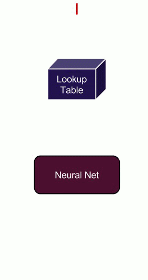
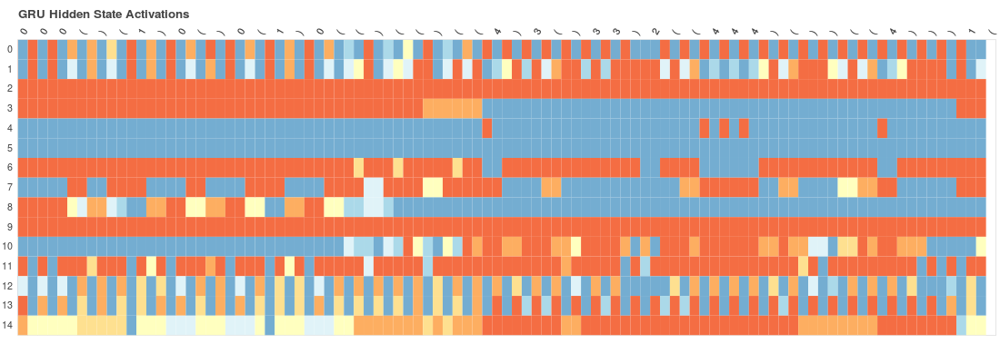

# Char RNN

This repository contains PyTorch code for training and visualising (through heatmaps) Recurrent Neural Networks.

## Recurrent Neural Networks
Recurrent Nets are Neural Network architecure for modelling sequences. The code in the repository is about the 2 main variants of RNN : **LSTM and GRU**.  
The working of RNN can be summarized in the following gif :-

The input to the RNN in our case is vectorized representation of characters.

## Installation

Create and activate a virtualenv. 
> virtualenv charrnn

> source charrnn/bin/activate

Install [ __PyTorch__ ](https://pytorch.org)
(see requirements.txt for the version, listed there  as torch)
 
Clone the repository
> git clone https://github.com/euler16/CharRNN.git

> cd CharRNN

Install other dependencies 
> pip install -r requirements.txt

Note:- not all dependencies mentioned in the requirements.txt file are required.

## Running the code

The model contains 3 main folders:- efficient, simple, visualisation.
The simple folder contains code for implementing an RNN from scratch (without using the LSTM/GRU module from Pytorch). The efficient folder contains code using the modules from PyTorch and also uses embedding table. The visualisation folder contains code for generating heatmaps.
 
In all three repositories run 
> python train.py --path/to/data

Check the argument parser code to know more about the arguments available.

## Visualization

In the visualisation folder, train a model using
> python vis_generate.py

Then run

> python heatmap_plot.py

Please see the argument parsers as well as the files that are being loaded and saved!! (if you are still facing problems file an issue here (code and installation related issues only)).

This code has been used for [ __this__ ](https://euler16.github.io/cs/2017/07/01/playing-with-rnn.html) blog post.
